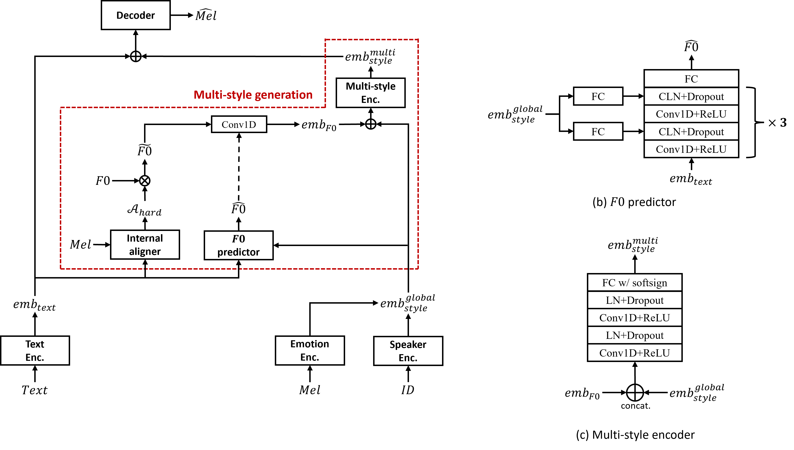

Submitted to INTERSPEECH 2022 (Paper ID: 988)

<h3>Authors
</h3>

Changhwan Kim, Seyun Um, Hyungchan Yoon, Hong-goo Kang

 

<h3>Proposed Method

</h3>

In this paper, we propose a method to flexibly control the local prosodic variation of a neural text-to-speech (TTS) model. To provide expressiveness for synthesized speech, conventional TTS models utilize utterance-wise global style embeddings that are obtained by compressing frame-level embeddings along the time axis. However, since utterance-wise global features do not contain sufficient information to represent the characteristics of word-level local features, they are not appropriate for direct use on controlling prosody at a fine scale. 
In multi-style TTS models, it is very important to have the capability to control local prosody because it plays a key role in finding the most appropriate text-to-speech pair among many one-to-many mapping candidates.
To explicitly present local prosodic characteristics to the contextual information of the corresponding input text, we propose a module to predict the fundamental frequency ($F0$) of each text by conditioning on the utterance-wise global style embedding.
We also estimate multi-style embeddings using a multi-style encoder, which takes as inputs both a global utterance-wise embedding and a local $F0$ embedding.
Our multi-style embedding enhances the naturalness and expressiveness of synthesized speech and is able to control prosody styles at the word-level or phoneme-level.

 

<h3>Samples

**[Case 1]**: Performance

 

**[Case 2]**: Utterance-level _F0_ control

 

**[Case 3]**: Word-level _F0_ control

 

**[Case 4]**: Phoneme-level _F0_ control

 

